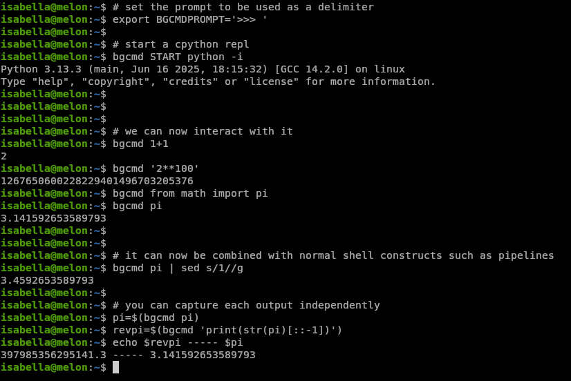

bgcmd
=====

bgcmd is a way to run almost any interactive repl in background

it keeps a persistent session between each line, and it prints any output
produced by the repl


usage
-----

1. set the `$BGCMDPROMPT` env var to your repl's prompt string
2. (optional) set the `$BGCMDDIR` env var to some private directory
   (it defaults to `$HOME/.bgcmd` otherwise)
3. run `bgcmd START your-repl-here arg1 arg2 arg3` to start the repl
4. run `bgcmd input here` to pass that input to the repl


after every invocation, the output from the repl will be printed to stdout

this lets you programmatically interact with repls and use their outputs

here's a demo of a cpython session:



faq/troubleshooting
-------------------

### why is this useful?  i could already type in a repl

your ai tools could not.  now they can now drive almost any most repl, as long
as they can run arbitrary shell commands.  for instance, claude code could not
easily use the [rr](https://rr-project.org) debugger (rr is an interactive
program but claude code would always wait for the whole session to time out or
terminate) but now it easily can

(rr has a a gdbmi interface but it doesn't help for this)


### what if my repl doesn't print a prompt when not writing to a terminal?

check if it accepts a `-i` parameter or something to force an interactive mode


### the bg process stays around forever?

bgcmd spawns a reader process that waits for your input through a fifo.  its
pid is stored in `$BGCMDDIR/pid`.  killing this process will send an end of
file to the repl, which causes most repls to gracefully terminate

restarting bgcmd with the same `$BGCMDDIR` will also do this for you


### can ai tools interact with multiple repls at the same time?

one way to do this is to create a few mini wrappers, one for each

for instance, this is a wrapper to run rr, which inspired this project:

```sh
#!/bin/sh

export BGCMDPROMPT='(rr) '
export BGCMDDIR=/home/potato/.bgcmdrr

if [ "$1" = START ]; then
    bgcmd START rr replay
else
    bgcmd "$@"
fi
```


### why does this not spawn a pty?

because then you'd get ansi escapes mixed in, and you'd have to remove them
before being able to use the reply from the repl


### my repl ignored/dropped the input and stuff got stuck

your repl is bad and you should use something else.  however, you can manually
resend the input by just writing it to the `in` fifo in `$BGCMDDIR`


### my repl printed the prompt as part of its output and things got out of sync

you can flush the state with `cat $BGCMDDIR/out > /dev/null`

unfortunately, waiting for the prompt is the only thing that works semi
generically for arbitrary repls.  yeah it's a bit jank

(btw since you fully control the repl, you can just not cause this to happen)


### it's 2025, why does this readme not say mcp at least x times?

mcp mcp mcp mcp mcp mcp mcp mcp mcp mcp mcp mcp mcp
